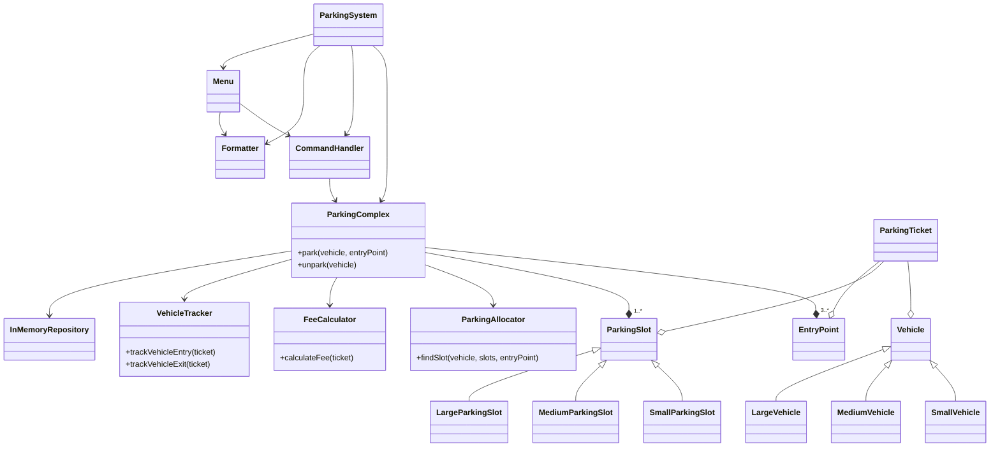
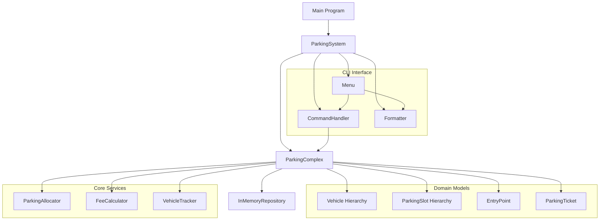

# OO Parking Lot

A CLI application implementing a parking allocation system for Object-Oriented Mall. This system automates parking slot assignment, vehicle tracking, and fee calculation according to complex pricing rules.

## Overview

This application simulates a parking complex with multiple entry points and various types of parking slots. It automatically assigns the closest available compatible slot to vehicles entering the complex, tracks parking durations, and calculates fees based on a sophisticated pricing structure.

## Requirements

- Ruby 3.3.4
- Bundler

## Installation

```bash
# Clone the repository
git clone https://github.com/prasaria/parking_lot_cli.git
cd parking_lot_cli

# Install dependencies
bundle install
```

## Usage

```bash
# Run the application
ruby main.rb

# Run tests
bundle exec rspec

# Run linting
bundle exec rubocop
```

## Available Commands

Once the application is running, you can use the following commands:

```bash
help                   - Show help message
status                 - Show parking complex status
park <id> <type> <entry> - Park a vehicle (type: small, medium, large)
unpark <id>            - Unpark a vehicle
slots [type]           - List parking slots (type: small, medium, large)
vehicles               - List parked vehicles
exit                   - Exit the application
```

## Examples

### Parking a Vehicle

```bash
park SV001 small 0
```

This will park a small vehicle with ID "SV001" entering from entry point 0.

### Unparking a Vehicle

```bash
unpark SV001
```

This will unpark the vehicle with ID "SV001" and calculate the parking fee.

### Viewing Status

```bash
status
```

This will display the current status of the parking complex.

## System Architecture



### Component Relationships



## Class Structures

### Domain Models

1. **Vehicle Hierarchy**
   - Abstract `Vehicle` class with `id` and `size` attributes
   - Concrete implementations: `SmallVehicle`, `MediumVehicle`, `LargeVehicle`
   - Each implements the `can_park_in?` method based on compatibility rules

2. **ParkingSlot Hierarchy**
   - Abstract `ParkingSlot` class with `id`, `size`, and `distances` attributes
   - Concrete implementations: `SmallParkingSlot`, `MediumParkingSlot`, `LargeParkingSlot`
   - Each implements the `can_fit?` method based on compatibility rules

3. **EntryPoint**
   - Represents an entrance to the parking complex
   - Has an `id` attribute

4. **ParkingTicket**
   - Records a parking session
   - Attributes: `vehicle`, `slot`, `entry_point`, `entry_time`, `exit_time`, `fee`
   - Has a `previous_ticket` reference for continuous rate calculation

### Core Services

1. **ParkingAllocator**
   - Responsible for finding the closest available compatible slot
   - Uses vehicle-slot compatibility rules and distances from entry points

2. **FeeCalculator**
   - Calculates parking fees based on complex pricing rules
   - Handles base rate, hourly rate, daily rate, and continuous rate

3. **VehicleTracker**
   - Tracks vehicles entering and exiting the parking complex
   - Maintains state of currently parked vehicles
   - Supports continuous rate by tracking exit times

### Repository Layer

1. **InMemoryRepository**
   - Stores and retrieves domain objects
   - Supports CRUD operations

### CLI Interface

1. **CommandHandler**
   - Parses and executes user commands
   - Maps commands to ParkingComplex operations

2. **Formatter**
   - Formats output for display in the CLI
   - Creates tables, headers, and styled messages

3. **Menu**
   - Manages the CLI interface and command loop
   - Handles user input and display

## Design Decisions

### 1. Object-Oriented Design

The application follows object-oriented principles with clear separation of concerns:

- **Domain models** represent real-world entities (vehicles, slots, tickets)
- **Services** implement business logic
- **Repository** handles data storage
- **CLI components** manage user interaction

### 2. Allocation Strategy

The parking slot allocation algorithm prioritizes:

1. Compatibility between vehicle and slot types
2. Availability of the slot
3. Distance from entry point (closest first)

### 3. Fee Calculation

The fee calculation implements complex rules:

- Base rate (40 pesos) for first 3 hours
- Hourly rates based on slot type for additional hours
- Daily rate (5000 pesos) for each 24-hour period
- Continuous rate for vehicles returning within 1 hour

### 4. Repository Pattern

Although a simple in-memory storage is used, the repository pattern allows for easy extension to persistent storage in the future.

### 5. Command Pattern

The CLI interface uses a command pattern to decouple command parsing from execution, making it easy to add new commands.

## Assumptions

1. **Entry/Exit Points**:
   - Entry points are also exit points
   - Entry points have numeric IDs starting from 0

2. **Distance Units**:
   - Distance is measured in abstract units
   - No physical meaning is assigned to these units

3. **Vehicle Identification**:
   - Vehicles are identified by unique string IDs (e.g., license plates)
   - No validation is performed on the format of these IDs

4. **Time Handling**:
   - System time is used for entry and exit times
   - Duration is rounded up to the nearest hour

5. **Parking Slots**:
   - Parking slots have fixed distances from entry points
   - Distance doesn't change over time

## Testing

The application includes:

- Unit tests for individual components
- Integration tests for component interactions
- End-to-end tests for complete execution flow

Run the test suite with:

```bash
bundle exec rspec
```

## License

This project is licensed under the MIT License and as a part of interview process
